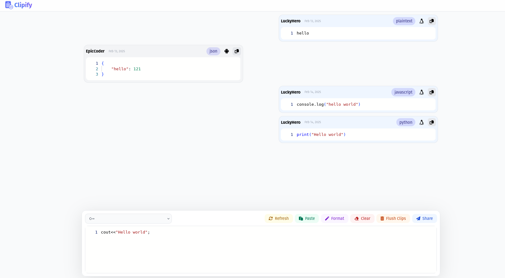

# Clipify Server Documentation

## Overview

`Clipify` is a simple web service that allows you to store and manage clips (text/code) data. It provides RESTful endpoints to add, retrieve, and delete (flush) clips data. The server supports both HTTP and HTTPS protocols. It is built using Go and SQLite as the backend database.

The following functionality is provided:

- **Add Clip**: Allows adding a new clipboard entry.
- **Get Clips**: Fetches all stored clips.
- **Flush Clips**: Clears all the clipboard data in the database. (Only available to IP running the server)
- **Format Editor**: Formats the text present in the editor.

This server also supports HTTPS for secure communication by providing an SSL certificate.



## Requirements


- Go 1.23+

## How to Run the Server

### Prerequisites

Before running the server, make sure you have the following dependencies installed:

- **Go**: Install the Go programming language [here](https://golang.org/dl/).
- **SQLite**: Ensure you have the `sqlite` library for Go (imported via `modernc.org/sqlite`).

### Running Without Docker

1. **Clone the Repository**: Clone the repository or copy the Go code to your local machine.
2. **Install Dependencies**: Install the necessary Go packages:
    ```bash
    go mod tidy
    ```
3. **SSL Certificates**: Ensure you have SSL certificates (`localhost.crt` and `localhost.key`) in the same directory as the Go source code. These certificates will be used for the HTTPS server.
    - If you don’t have them, you can generate self-signed certificates using OpenSSL:
        ```bash
        openssl req -new -newkey rsa:2048 -days 365 -nodes -x509 -keyout localhost.key -out localhost.crt
        ```
4. **Run the Server**: Start the Go server:
    ```bash
    go run main.go
    ```
    The server will be running both on HTTP (default port 8080) and HTTPS (default port 8443). It will listen on your local machine's IP address.

### Running With Docker

To run the `Clipify` server using Docker, follow the steps below:

1. **Ensure Dockerfile and SSL Certificates Are Present**: The repository already contains a Dockerfile along with the required SSL certificates (`localhost.crt` and `localhost.key`).

2. **Build the Docker Image**:
    ```bash
    docker build -t clipify .
    ```

3. **Run the Docker Container**: Run the container using the following command to ensure proper networking:

    ```bash
    docker run -d --network host --name clipify clipify
    ```

    The `--network host` flag is necessary for the container to correctly bind to your local machine's network interfaces.

4. **Access the Server**: Once the container is running, the server will be accessible at:

    - **HTTP**: `http://<local_ip>:8080`
    - **HTTPS**: `https://<local_ip>:8443`

Where `<local_ip>` is the local IP address of your machine. You can get the IP using `ifconfig` or `ipconfig`.

### Environment Variables

You can customize the server's HTTP and HTTPS ports using the following environment variables:

- `CLIPIFY_HTTP_PORT`: The port for HTTP (default is `8080`).
- `CLIPIFY_HTTPS_PORT`: The port for HTTPS (default is `8443`).

For example, to run the server on port `9000` for HTTP and port `9443` for HTTPS, you can run:

```bash
CLIPIFY_HTTP_PORT=9000 CLIPIFY_HTTPS_PORT=9443 docker run -d --network host --name clipify clipify
```

## Contributing

Contributions are welcome! Please

1. Fork the repository
2. Create a feature branch
3. Make your changes
4. Test the changes
5. Submit a pull request

## License

Apache License 2.0 - see LICENSE file for details
